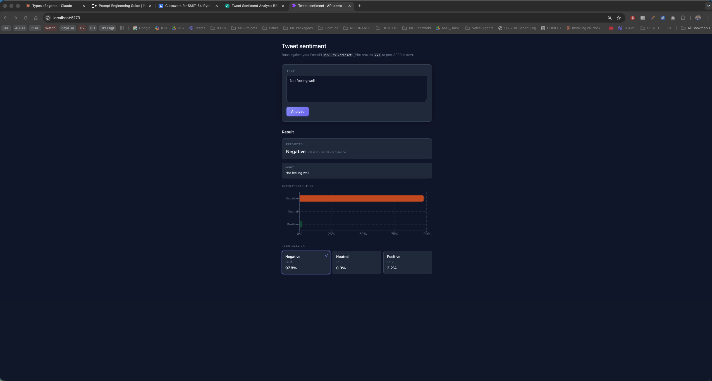

# Tweet sentiment analysis (BERT)

End-to-end **Sentiment140-style** tweet classification: data cleaning and splits, **PyTorch** fine-tuning of a BERT classifier, **FastAPI** inference, and a **React (Vite)** UI.

## App preview



The frontend calls `POST /v1/predict` on the API and shows softmax probabilities plus label marking (negative / neutral / positive).

---

## Prerequisites

- **Python** 3.10+
- **[uv](https://docs.astral.sh/uv/)** (recommended) or `pip`
- **Node.js** 18+ and **npm** (for the `app/` frontend)

---

## 1. Environment setup

From the repository root:

```bash
uv venv
source .venv/bin/activate   # Windows: .venv\Scripts\activate
uv sync
```

Install frontend dependencies:

```bash
cd app && npm install && cd ..
```

Optional: Hugging Face downloads may need a token if you are rate-limited:

```bash
export HF_TOKEN=your_token_here
```

---

## 2. Data and ML pipelines

Config is resolved by `src.utils.load_config`: optional `CONFIG_PATH`, then `APP_ENV` (`prod` → `prod.config.yaml`, otherwise `dev.config.yaml`), else `config.yaml`. Defaults match **local dev** (`dev.config.yaml`).

### 2.1 Place raw CSVs

Put Sentiment140-style CSV files under **`dataset/raw/`** (see `data.raw_path` in your YAML). The loader expects `target` and `tweet_text` (or the classic six-column format).

### 2.2 Preprocessing (clean + label map + splits)

Maps raw labels **0 → negative (0), 2 → neutral (1), 4 → positive (2)** and writes:

- `dataset/processed/cleaned_<name>.csv`
- `dataset/processed/train_<stem>.csv`, `val_<stem>.csv`, `test_<stem>.csv`

```bash
# Dev (default)
python -m src.pipelines.data_preprocessing

# Prod config
APP_ENV=prod python -m src.pipelines.data_preprocessing

# Explicit file
CONFIG_PATH=prod.config.yaml python -m src.pipelines.data_preprocessing
```

This also ensures the base BERT and tokenizer exist under **`artifacts/bert/`** (download on first run).

### 2.3 Download / cache model weights (Hugging Face)

Training and inference use **`model.name`** from config (e.g. `prajjwal1/bert-tiny` in dev). Weights are downloaded automatically via **Transformers** when you preprocess (base model) and when the classifier loads. No separate manual HF step is required unless you want offline copies.

### 2.4 Train

Writes per-epoch checkpoints and **`best_model.pt`** under `model.checkpoint_path` (dev: **`artifacts/checkpoints-dev/`**).

```bash
python -m src.pipelines.model_training
```

### 2.5 Evaluate (test split)

Loads **`{model.checkpoint_path}/best_model.pt`** unless `model.eval_checkpoint` is set.

```bash
python -m src.pipelines.model_evaluation
```

Metrics are printed and saved as `test_metrics.json` next to your checkpoints.

---

## 3. API and web app

### 3.1 FastAPI backend

From the **repository root** (with `.venv` activated):

```bash
uvicorn api.main:app --reload --host 0.0.0.0 --port 8000
```

- Docs: [http://127.0.0.1:8000/docs](http://127.0.0.1:8000/docs)
- Predict: `POST http://127.0.0.1:8000/v1/predict` with JSON `{"text": "your tweet"}`

The API loads **`best_model.pt`** from `model.checkpoint_path` when present; otherwise it logs a warning and serves **random** weights until you train or drop in a checkpoint.

### 3.2 React frontend (`app/`)

In one terminal, keep the API on port **8000**. In another:

```bash
cd app
npm run dev
```

Open the URL Vite prints (e.g. [http://localhost:5173](http://localhost:5173)). During dev, **`vite.config.js`** proxies **`/v1`** to `http://127.0.0.1:8000`, so the browser calls the same origin and avoids CORS.

**Production build** (API on another host):

```bash
cd app
echo 'VITE_API_BASE_URL=https://your-api.example.com' > .env
npm run build
npm run preview   # optional local check of dist/
```

See **`app/.env.example`** and **`app/README.md`** for details.

---

## 5. Linting

```bash
ruff check .
ruff format .
cd app && npm run lint
```

---

## Repository layout (short)

| Path | Role |
|------|------|
| `src/pipelines/` | Preprocess, train, evaluate CLIs |
| `src/model/` | Architecture, trainer, checkpoints |
| `src/data/` | Loader, dataset, splits, cleaning |
| `api/` | FastAPI app and `/v1/predict` |
| `app/` | Vite + React UI |
| `dev.config.yaml` / `prod.config.yaml` | Data paths, model id, epochs, checkpoint dir |
